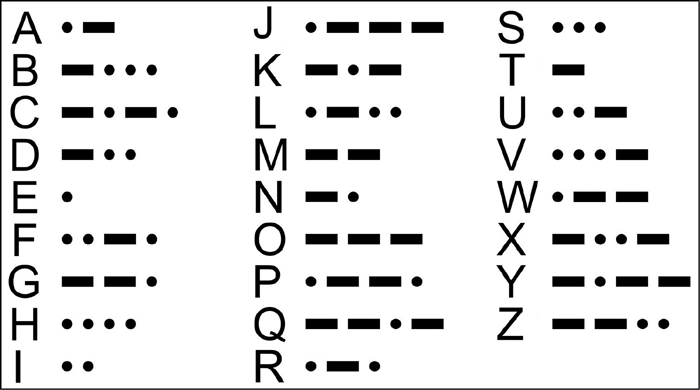

<h1 align="center">
    
</h1>

  <a href="#-projeto">Projeto</a>
  &nbsp;&nbsp;&nbsp;|&nbsp;&nbsp;&nbsp;
  <a href="#-tecnologias">Exemplo</a>

## ✦ Projeto

O projeto consistiu na implementação de um decodificador para o código morse. Assim sendo, o programa traduz uma mensagem tanto DO Morse quanto PARA o Morse. Como estratégia de implementação foi utilizada a estrutura de dados árvore binária. A seguir, a codificação Morse:

    

## ✦ Exemplo

- Mensagem Orginal: A CASA DE MARCOS E MARIA TEM DOIS QUARTOS

- Mensagem Traduzida: .- -.-. .- ... .-  -.. .  -- .- .-. -.-. --- ...  .  -- .- .-. .. .-  - . --  -.. --- .. ...  --.- ..- .- .-. - --- ...

---

O projeto foi desenvolvido, para fins didáticos, durante a disciplina de Algoritmos e Estrutura de Dados II do curso de Bacharelado em Ciência da Computação da UFV – Campus Florestal

